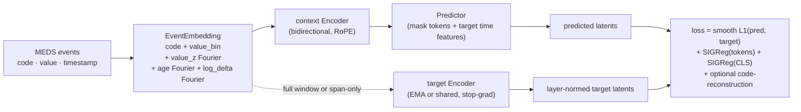
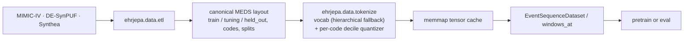
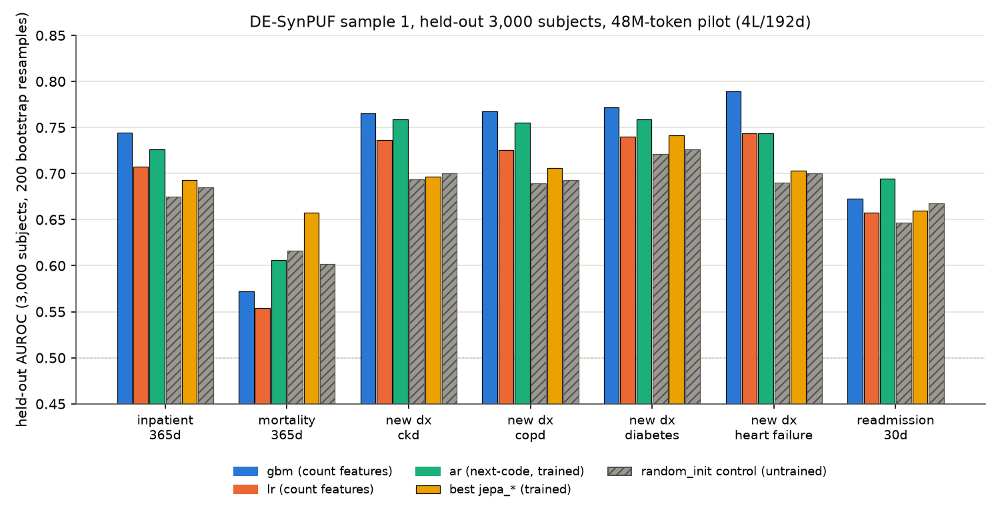
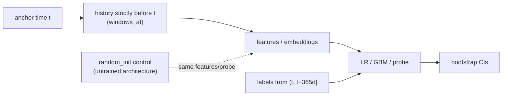

# EHRJEPA

A joint-embedding predictive architecture for longitudinal electronic health
records. Each patient is a stream of clinical events in
[MEDS](https://github.com/Medical-Event-Data-Standard/meds) format — one token
per event, whose embedding fuses a learned code embedding with a continuous
value embedding and is positioned by continuous time rather than by ordinal
index, so irregular sampling and long gaps are represented as they actually
occurred. A context encoder reads the observed events; a latent predictor,
conditioned on the time positions of a masked future span, predicts that span's
representations; an EMA copy of the encoder produces the targets. Nothing is
reconstructed in input space — prediction happens entirely in latent space, so
the model is not forced to model unpredictable per-event detail. Collapse is
prevented by a SIGReg-style distributional regularizer following LeJEPA
([arXiv:2511.08544](https://arxiv.org/abs/2511.08544)), which pushes embeddings
toward an isotropic Gaussian via random one-dimensional projections instead of
relying on architectural asymmetry or negatives.

## Architecture



*The context encoder and predictor carry gradients; the target encoder runs
under stop-gradient (`target_mode: shared` or `ema`) and is never told what
code or value the masked span actually holds.*

## Status

**Under active rebuild. No results yet.**

There are no pretrained weights, no benchmark numbers, and no claims of
performance in this repository. The previous visit-vector prototype has been
archived under [`legacy/`](legacy/README.md); it has known label leakage and
none of its numbers are valid.

What exists now: the MEDS ETL and tensor cache (`data/`), the three networks
(`models/`), the SIGReg + latent-prediction objective and a next-code
autoregressive baseline that shares its embedding and encoder (`objectives/`), a
resumable pretraining loop (`train/`), a downstream evaluation harness (`eval/`)
with ACES-defined tasks, count-feature baselines, frozen-encoder probes and
bootstrap intervals, and an ablation runner that trains a grid of objectives to a
matched token budget and evaluates each (`scripts/ablate.py`). The runs recorded
under `docs/experiments/` are short MPS sanity runs, one evaluation of the
checkpoints they produced, and a pilot ablation grid; none of the checkpoints
involved is trained long enough for its numbers to be a statement about the
architecture.

## Data access

No data is included or committed; everything under `data/` is gitignored.

- **MIMIC-IV** — credentialed access via
  [PhysioNet](https://physionet.org/content/mimiciv/) (CITI training + signed
  DUA). Lowered to MEDS with `meds_etl`.
- **EHRSHOT** — Stanford Redivis, under its own data use agreement.
- **Development** — the MIMIC-IV *demo* subset and Synthea-generated records are
  open and are what the pipeline is developed against; they are small and
  synthetic/partial, so they are for plumbing only, never for evaluation.
- **Evaluation** — downstream tasks will be defined through
  [MEDS-DEV](https://github.com/mmcdermott/MEDS-DEV) / ACES so cohorts and label
  windows are declarative and reproducible, plus the EHRSHOT task suite.

### Data pipeline



*Each source is lowered to the same canonical MEDS layout once; the tensor
cache and vocabulary are fit only on the `train` split and then reused for
`tuning` and `held_out`.*

## Pilot results

<p align="center">
  
</p>

*At this 48M-token budget, `ar` beats its untrained `random_init@ar` control on
6 of 7 tasks (mean AUROC 0.7205 vs. 0.6760); grid 1's `jepa_*` variants
(0.6776–0.6901) sit within 0.008 of their shared `random_init@jepa_ema`
control (0.6821). Grids 2–4 (20 trained cells total) are consolidated in
[`docs/experiments/PILOT_RESULTS.md`](docs/experiments/PILOT_RESULTS.md); grid
5 reseeds `ar` and the hybrid at 2 more seeds each (3 total), and a follow-up
run adds few-shot AUROC (k=32, 128, all) for `lr`, `gbm`, `ar`, and the
hybrid.*

**Current findings** (from
[`docs/experiments/PILOT_RESULTS.md`](docs/experiments/PILOT_RESULTS.md), the
consolidated table for grids 1-4: 20 trained cells, 2,930 steps /
48,005,120 tokens each, 3,000 held-out DE-SynPUF subjects, 200 bootstrap
resamples, seed 0):

- `ar` scores mean AUROC 0.7205 across the 7 tasks, +0.0445 over its own
  `random_init@ar` control (0.6760).
- Grid 1's five masked-span JEPA variants (target, SIGReg, and masking-mix
  swept one at a time off `jepa_ema`) score mean AUROC 0.6776-0.6901 against
  one shared `random_init@jepa_ema` control (0.6821): gain -0.0046 to +0.0080.
- Grid 2's five cells (closing a time-conditional-prior shortcut, a
  context-copy shortcut, or both, with and without an auxiliary code-recon
  term) score mean AUROC 0.6750-0.6999 against `random_init@jepa_notime`
  (0.6736): gain +0.0014 to +0.0263.
- Grid 3's four cells isolate the code-reconstruction term from the latent
  smooth-L1 term: `recon_only` (no latent term) scores 0.6990, 0.0041 AUROC
  below `jepa_recon_notime` (latent term + recon + notime, 0.7031).
- Grid 4's `nextlatent_h1416_recon` (dense causal next-latent prediction at
  horizons [1,4,16] plus the AR next-code loss through the same tied head)
  scores mean AUROC 0.7287, +0.0923 over its `random_init@nextlatent_h1`
  control (0.6364) — the highest gain and highest mean AUROC of all 20 trained
  cells in grids 1-4.
- The count-feature baselines score mean AUROC 0.7261 (`gbm`) and 0.6949
  (`lr`) across the same tasks.
- Every cell above is seed 0, except `ar` and the hybrid (see below).
- Grid 5 reseeds `ar` (grid 1) and the hybrid (`nextlatent_h1416_recon`,
  grid 4) at 2 more seeds each. 3-seed mean AUROC across the 7 tasks: `ar`
  0.7234 (range across tasks of the per-task 3-seed std: 0.0009-0.0069),
  hybrid 0.7279 (0.0018-0.0109). Per-task detail in
  [`docs/experiments/PILOT_RESULTS.md`](docs/experiments/PILOT_RESULTS.md#grid-5-seeds).
- Few-shot AUROC (k=32 / k=128 / all, mean over 3 training seeds for `ar`/
  hybrid, over 5 few-shot seeds for `lr`) averaged across the 7 tasks: `lr`
  0.6111 / 0.6407 / 0.6949; `ar` 0.6491 / 0.6802 / 0.7234; hybrid 0.6518 /
  0.6835 / 0.7279 (`gbm` has no few-shot fits in the current eval path; its
  full-split number is the 0.7261 above). Full table and protocol in
  [`docs/experiments/2026-09-04-fewshot-desynpuf/`](docs/experiments/2026-09-04-fewshot-desynpuf/).

## Quickstart

```bash
git clone https://github.com/Abelo9996/EHRJEPA.git
cd EHRJEPA

uv venv --python 3.12
uv pip install -e ".[dev]"

uv run pytest
uv run ruff check .
uv run pre-commit install   # optional
```

Verify the install:

```bash
uv run python -c "import ehrjepa; print(ehrjepa.__version__)"
```

Pretrain (needs a tensor cache built by `python -m ehrjepa.data.tokenize build`):

```bash
uv run python -m ehrjepa.train.pretrain --config configs/pretrain_small.yaml \
  --override run.steps=2000 optim.lr=3e-4
```

## Layout

```
src/ehrjepa/
  data/        MEDS ETL, vocabulary, tokenization, datasets and collators
  models/      event encoder (bidirectional or causal), latent predictor,
               EMA target encoder, next-code AR model
  objectives/  latent prediction loss, SIGReg anti-collapse regularizer,
               next-code cross-entropy
  train/       YAML config, training loop, checkpointing
  eval/        MEDS-DEV/ACES + EHRSHOT tasks, frozen-encoder probes, baselines
  utils/       seeding, device selection, logging, run directories
scripts/       ablate.py (ablation grids), throughput.py (tok/s measurement)
configs/       YAML run configs and ablation grids (configs/grids/)
docs/          experiment logs
tests/         test suite
legacy/        archived pre-rebuild visit-vector pipeline — do not build on it
```

## Evaluation protocol



*Anchors are drawn strictly before any death event, so no event at or after
`MEDS_DEATH` ever enters a history window; `random_init` runs the same probe
through the same, but untrained, architecture as its control.*

## Roadmap

- Grid 5: a seed sweep on a subset of grids 1-4's cells (training now).
- Scale up on an RTX 4070 with the full MIMIC-IV v3.1 extract.
- Evaluate against the EHRSHOT task suite and MEDS-DEV.
- Release: pretrained weights, benchmark numbers, and a citable preprint.

## Development

Ruff (line length 100) for lint and formatting, pytest for tests, pre-commit for
both on commit. CI runs ruff and pytest on Ubuntu with uv.

## License

Apache-2.0. See [LICENSE](LICENSE).

## Acknowledgments

The design draws on the JEPA line of work — I-JEPA, V-JEPA 2, and LeJEPA
(arXiv:2511.08544) — for the latent-prediction formulation and the SIGReg
anti-collapse objective, and on MEDS and MEDS-DEV/ACES for the data and task
standards. **No code from those projects is included here.** An earlier version
of this repository contained files derived from Meta's I-JEPA, which is
CC-BY-NC-licensed; all of it has been removed so this project can be released
under Apache-2.0.

## Citation

See [CITATION.cff](CITATION.cff) — a placeholder. There is no release or
preprint to cite yet.
