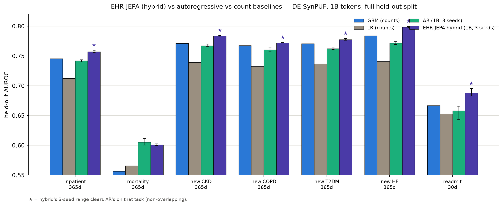
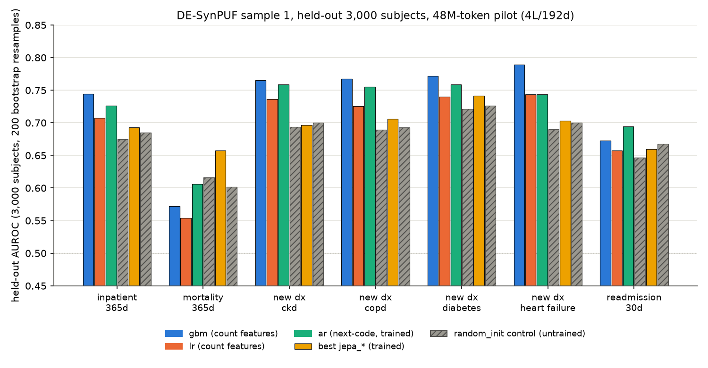
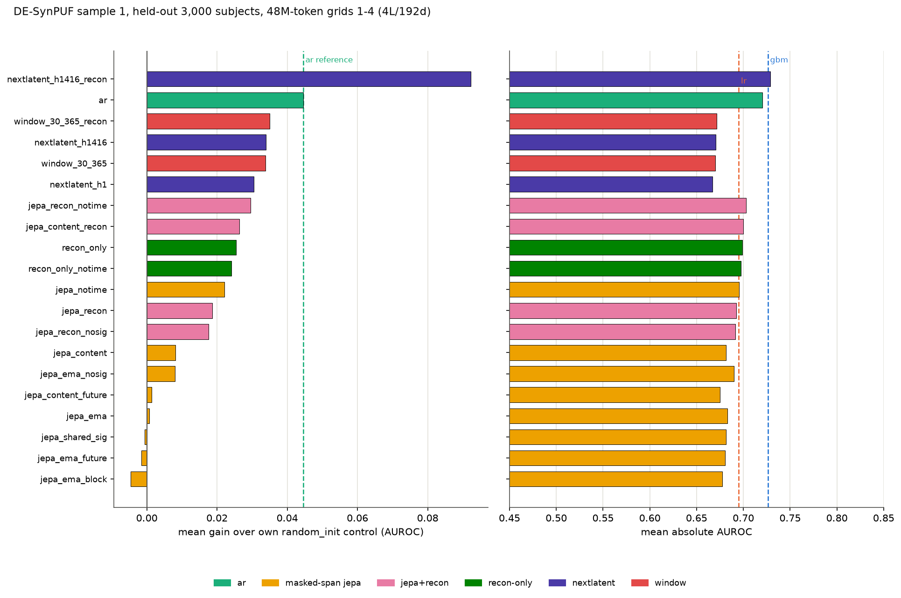
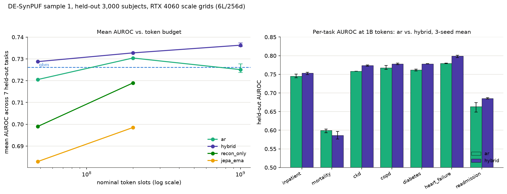
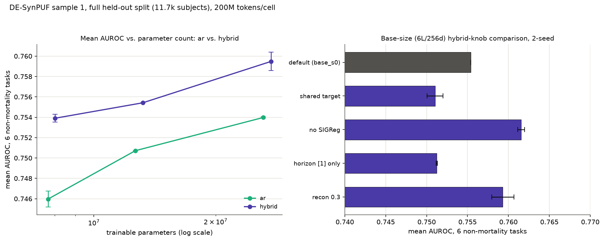
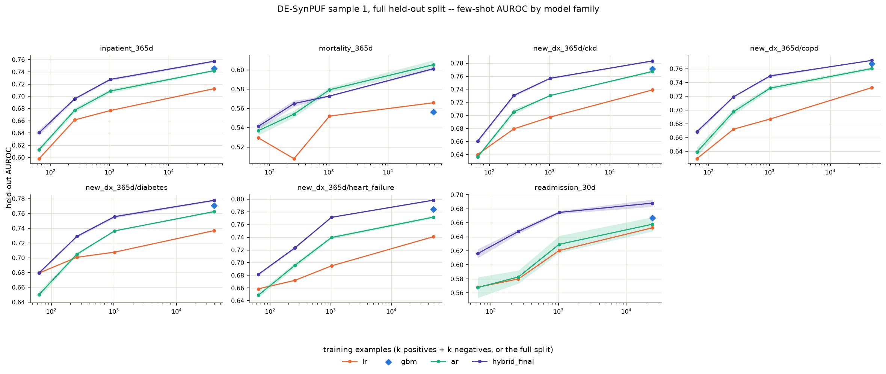
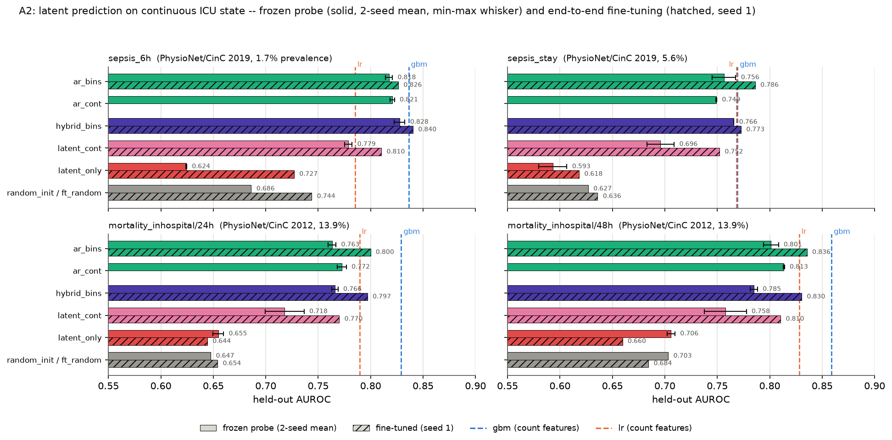
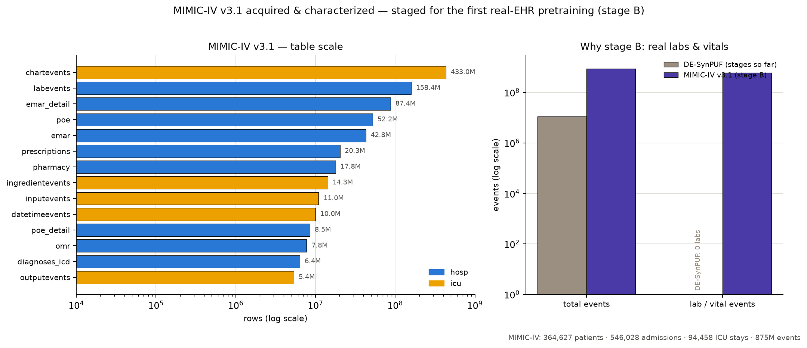
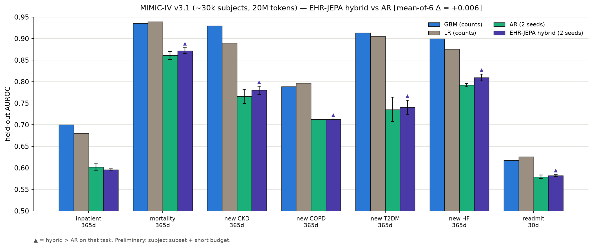

# EHR-JEPA — Design, Experiments & Results

*A presentation-ready walkthrough of the project. Every number here is copied from a committed
`summary.md` / `results.md` table — nothing is fabricated or rounded to flatter. Verdicts are
quoted as written, including the negative one.*

Figures live in [`docs/figures/`](figures/) and are regenerated from committed data by
`scripts/plot_*.py` (no plotted number is one that isn't already in a committed table).

---

## TL;DR (the one slide)

We test whether a **JEPA-style objective** — predicting future clinical events *in representation
space* instead of predicting the next code — helps for longitudinal EHR foundation models.

- **Masked-span latent JEPA alone fails**: at 48M tokens it does not clear its own untrained control
  (0.678–0.690 vs. a 0.682 random-init control). We diagnose *why*.
- **A hybrid — dense causal next-latent prediction + a tied next-code loss — is the strongest
  objective at every compute budget.** At **1B tokens, 3 seeds, full 11,708-subject held-out split**
  it beats an autoregressive baseline on **all 6 non-mortality tasks with non-overlapping seed
  ranges** (mean AUROC **0.763 vs 0.744**), and beats GBM/LR count baselines.
- **AR plateaus 200M→1B; the hybrid keeps improving.**
- On **continuous ICU state** (PhysioNet), latent objectives *without* a code loss never beat binned
  AR → the strong "predicting in latent space is itself the useful part" claim is **not supported**;
  what survives is *the hybrid as a regularizer riding on a code-prediction loss*.

*1B tokens, 3 seeds, full held-out split. ★ = hybrid's 3-seed range clears AR's (non-overlapping).*

---

## 1. Problem & motivation

An EHR is a stream of timestamped clinical events at irregular intervals over years. The dominant
self-supervised recipe is **next-token autoregression over serialized codes** (CLMBR, ETHOS,
CEHR-GPT, EHRMamba). That recipe spends its whole capacity predicting the identity of the next
discrete symbol — including the large fraction of symbol identity that is administrative or arbitrary
(which billable code a clinician picks, which interchangeable NDC a pharmacy dispenses). Those "are
not facts a representation of the patient needs to carry."

**JEPA** predicts in representation space: a context encoder reads observed events; a predictor,
conditioned on *where/when* unobserved events fall, predicts the *representations* a stop-gradient
target encoder assigns them. Nothing is reconstructed in input space, so the objective is free to
discard unpredictable detail; collapse is prevented by SIGReg (LeJEPA). On paper a good match for
clinical streams. **This project measured what actually happens.**

> **Framing, honestly.** DE-SynPUF is a synthetic CMS public-use file whose history→future structure
> is weakened by construction, so absolute AUROCs are a property of the source and are **not
> comparable** to published MIMIC-IV / EHRSHOT numbers. The design supports only *relative*
> comparisons at matched compute, on identical rows, against an untrained control and a count-feature
> ceiling.

---

## 2. Design

### Event embedding (a *sum*, nothing concatenated)
`x_i = E_code[c_i] + E_bin[b_i] + 1[b_i≠0]·g_v(z_i) + m_i·(g_a(a_i) + g_δ(d_i))`
- `E_code`: learned table over a **30,000-code** hierarchical-fallback vocabulary.
- `E_bin`: 11 value-bin classes (10 per-code deciles + a bin-0 for value-less events). The gate
  `1[b_i≠0]` distinguishes "no value" from "exactly average."
- `g_v, g_a, g_δ`: small nets over a fixed **Fourier featurization** (K=16). **Time enters twice** —
  as content (age `g_a`, log inter-event gap `g_δ`) *and* as position (RoPE). This separation is what
  makes the `notime` ablations possible.
- `m_i`: per-token time-feature dropout (train only).

### Encoder / predictor / target
- **Encoder**: pre-norm transformer, fused QKV, **RoPE on Q/K only** (sequence-index positions —
  irregular spacing already lives in `g_δ`), **SwiGLU** FFN, learned `[CLS]`. Runs **bidirectional**
  for masked-span, **causal** for AR / next-latent (causal probes read the last valid token).
- **Predictor** (masked-span only): the mask token carries the target's *time and nothing else*; a
  unit test asserts no target content leaks.
- **Target encoder**: stop-grad, **EMA** (momentum 0.996→1.0, freezing at end) in every reported run.

### The five objective families
`L = λ_pred·L_latent + λ_sig·SIGReg + λ_recon·(L_code + L_bin)`
| family | idea | verdict preview |
|---|---|---|
| (a) **masked-span latent JEPA** | predict masked future spans in latent space | fails alone |
| (b) **causal next-latent JEPA** | per-horizon MLP predicts latent of event *i+k* | the winning ingredient |
| (c) **window-pooled latent JEPA** | predict mean latent inside a future horizon | — |
| (d) **next-code AR** | tied softmax over 30k codes (the baseline) | transfers |
| (e) **hybrid** = (b) horizons {1,4,16} + (d) | next-latent **+** tied next-code | **best at every budget** |

Setting `λ_pred=0` reduces the hybrid to next-code AR *exactly* (unit-tested) — so the hybrid reads as
a **controlled addition to AR**.

### Final default config (`configs/pretrain_default.yaml`)
`nextlatent`, horizons **[1,4,16]**, **causal**, target **EMA**, `λ_recon=0.1`, **`λ_sigreg=0.0`
(SIGReg dropped)**; encoder dim 256 / depth 6 / heads 4 (SwiGLU, mlp_ratio 4, dropout 0.1); predictor
dim 128 / depth 4; tied embeddings; lr 3e-4, wd 0.05, betas (0.9, 0.95), warmup 100, bf16, batch 64,
`max_len 512`.

---

## 3. Experimental protocol

**Datasets** (each lowered once to canonical MEDS → train / tuning / held_out):
- **DE-SynPUF sample 1** — CMS claims PUF, **no labs/vitals/notes**; held-out **11,708 subjects**
  (full split) vs. an earlier seeded **3,000-subject** subset.
- **PhysioNet/CinC 2019** (sepsis; 40,336 stays, 99.1% numeric) and **2012** (mortality; 12,000
  stays, 99.3% numeric) — the continuous-state stage.
- **Synthea** — plumbing only. **MIMIC-IV v3.1** — newly acquired (§5).

**7 DE-SynPUF tasks**: `inpatient_365d`, `mortality_365d`, `new_dx_365d/{ckd,copd,diabetes,heart_failure}`,
`readmission_30d`. **ICU tasks**: `sepsis_6h`, `sepsis_stay`, `mortality_inhospital/{24h,48h}`.

**Invariants**: ≥2-seed rule for any decision (3 seeds at 1B for ar/hybrid); strict leakage discipline
(history < anchor `t`, labels in (t, t+365d], anchors before any death); **count-feature LR & GBM
baselines**; **random-init controls** (same architecture, untrained, pooling-matched); 200-resample
bootstrap 95% CIs; frozen linear probe as the DE-SynPUF readout, fine-tuning for the ICU stage;
few-shot at k = 32/128/512/all.

---

## 4. Results

### 4.1 Which objectives transfer — pilot grids (48M tokens, 20 cells)

- The five **masked-span `jepa_ema*`** variants score **0.678–0.690** against their own
  `random_init` control of **0.682** — gains **−0.005 to +0.008**. Masked-span latent prediction
  **does not move a frozen probe past its untrained control.**
- **`ar` transfers** (+0.045 over control); the **hybrid `nextlatent_h1416_recon` is the top cell of
  all 20** (mean 0.7287, +0.092 over control — above even GBM's 0.7261).

**Why masked-span fails (diagnosed):** a ridge map from the mask-token *time features alone* recovers
most of the predictor output (R²≈0.58 vs 0.79 with context); a code-identity probe reads *worse* off
the trained JEPA encoder (top-1 0.50) than off an untrained one (0.60) or an AR encoder (0.71). The
latent target is dominated by time-and-context priors over low-entropy discrete events, which the
predictor satisfies **without carrying code identity.** *(Caveat: these diagnostic numbers are
one-off measurements, not reproducible from committed code — see §7.)*

### 4.2 Scaling 48M → 200M → 1B

| tokens | `ar` mean | hybrid mean |
|---|---|---|
| 48M | 0.7205 | 0.7287 |
| 200M | 0.7304 | 0.7328 |
| **1B (3-seed, full split, mean-of-6)** | **0.7436** | **0.7628** |

**AR plateaus** 200M→1B (subset mean drops on 6/7 tasks); **the hybrid improves at every step.**

### 4.3 The 1B / 3-seed headline (full 11,708-subject held-out split)

*(see the TL;DR figure above)*

| task | `ar` (3-seed) | `hybrid_final` (3-seed) | ranges overlap? |
|---|---|---|---|
| inpatient_365d | 0.7420 | **0.7573** | no |
| mortality_365d | **0.6053** | 0.6011 | yes |
| new CKD 365d | 0.7674 | **0.7834** | no |
| new COPD 365d | 0.7603 | **0.7721** | no |
| new T2DM 365d | 0.7625 | **0.7777** | no |
| new HF 365d | 0.7715 | **0.7982** | no |
| readmission_30d | 0.6580 | **0.6881** | no |
| **mean-of-6 (excl. mortality)** | **0.7436** | **0.7628** | non-overlapping on all 6 |

Baselines (mean-of-6): **GBM 0.7511, LR 0.7191**. `hybrid_final` clears GBM, LR, and beats AR on every
non-mortality task with non-overlapping 3-seed ranges (paired bootstrap on identical subjects confirms
p ≈ 0.00–0.05 on all six; not significant on mortality).

### 4.4 Ablations — what actually helps (200M, full split, 2 seeds)

- **Size**: hybrid leads AR at small/base/large (+0.008 / +0.005 / +0.006). *The gap does not close
  with size.*
- **Best single knob — drop SIGReg**: 0.7554 → **0.7615** (+0.6). A **frozen 1B-AR teacher** helps by
  the *same* +0.6 — and **the two do not stack** (both = 0.7625). Default = EMA + no SIGReg
  (self-contained, no separately staged checkpoint).
- **Text-init code embeddings neutral** (+0.001); freezing the text table costs only 0.1 while
  removing **58% of trainable params** (the 30k code table is the majority of the model).

### 4.5 Few-shot (1B, full held-out, mean-of-6 non-mortality)

| family | k=32 | k=128 | k=512 | k=all |
|---|---|---|---|---|
| LR | 0.6289 | 0.6610 | 0.6807 | 0.7191 |
| AR | 0.6258 | 0.6773 | 0.7127 | 0.7436 |
| **hybrid_final** | **0.6578** | **0.7076** | **0.7393** | **0.7628** |

The hybrid leads at **every** label budget (biggest relative edge in the low-data regime).

### 4.6 Stage A2 — continuous ICU state (the honest negative result)

Pre-registered test: does a latent objective do work of its own on **continuous** state (99% numeric),
or only ride on a code loss? The two **code-loss-free** objectives (`latent_cont`, `latent_only`) are
**below every binned-AR number on all four tasks, at both probe seeds and under fine-tuning.**
`latent_only` is even *below its random-init control* on the sepsis tasks.

> **Verdict (quoted):** "the JEPA framing — that predicting in representation space is itself the
> useful part — is **not supported**; the claim this project's evidence carries is limited to the
> hybrid as a regularizer riding on a code-prediction loss."

**The one win:** fine-tuned `hybrid_bins` = **0.8403** on `sepsis_6h` — the *only* trained cell above
GBM (0.8363) on any ICU task. GBM otherwise remains a hard count-feature ceiling.

---

## 5. MIMIC-IV v3.1 — status

*(Filled by the characterization run; see [`docs/experiments/mimic-iv/`](experiments/mimic-iv/).)*

- **Acquired**: MIMIC-IV v3.1 (hosp + icu) pulled via BigQuery, sorted, verified, and delivered to the
  GPU box — **byte-identical SHA-256** end to end.
- **Ingest path**: `python -m ehrjepa.data.etl mimic` wraps `meds_etl.mimic` into our canonical MEDS
  layout with our deterministic splits.
- **Where it fits**: this is **stage B** — the first run on *real* hospital data with labs/vitals
  (which DE-SynPUF lacks), exercising the value-quantizer/value-embedding path that has barely been
  used so far.

**Characterized (exact counts, from the v3.1 files — [`docs/experiments/mimic-iv/`](experiments/mimic-iv/)):**

| quantity | MIMIC-IV v3.1 | DE-SynPUF (so far) |
|---|---|---|
| patients | **364,627** | — |
| admissions | **546,028** | — |
| ICU stays | **94,458** | — |
| total events | **875 M** | ≈ 11.3 M |
| lab + chart events | **591 M** (158M labs + 433M chart) | **0** |
| ICD-dx / chart-item / lab-item vocab | 112,107 / 4,095 / 1,650 | n/a |

MIMIC brings ~**77× more events** than DE-SynPUF *and* a whole lab/vital modality DE-SynPUF lacks —
which is exactly the value path the ablations flagged as under-exercised. **Status: acquired, verified
(SHA-256 identical end-to-end), characterized, and the full pipeline validated end-to-end** (ETL →
cache → train → eval; `meds_etl` patched for two MIMIC-IV v3.1 incompatibilities — nullable admission
fields and a shard-memory OOM).

### Preliminary hybrid-vs-AR on MIMIC-IV (honest — within noise)

A first comparison on a ~30k-subject subset, 2 seeds, at two budgets (20M and 100M tokens), evaluated
on the same seven task configs (their predicates already map to MIMIC codes).

- **The comparison is within seed noise.** Both budgets give mean-of-6 non-mortality Δ ≈ **+0.006**
  (100M: hybrid 0.748 vs AR 0.743), but the *per-task* wins flip between budgets (CKD/HF favor hybrid
  at 20M, AR at 100M) — so **the clean DE-SynPUF advantage does not reproduce on MIMIC at this scale.**
- **Real positives:** trained encoders beat their random-init control on every task and improve with
  training (CKD .78→.85, mortality .87→.91 over 20M→100M); on **readmission the encoders beat the
  count baselines** (.63 vs GBM .617 / LR .626).
- Both still trail GBM/LR on the pure-diagnosis tasks (.88–.94) — the diagnosis code sits directly in
  the count features (a famously high bar on MIMIC).
- **Context / honest boundary:** on DE-SynPUF the hybrid edge was also small at pilot scale (+0.008 at
  48M) and only became statistically clean at **1B tokens** — so a full-scale MIMIC stage-B run is the
  honest next step; no MIMIC win is claimed here.

---

## 6. Takeaways

1. Masked-span latent JEPA **alone doesn't clear its own untrained control.**
2. A **causal next-latent + tied next-code hybrid** is the strongest objective at 48M / 200M / 1B.
3. At 1B (3 seeds, full split) the hybrid beats AR on **all 6 non-mortality tasks, non-overlapping
   ranges**, and beats GBM/LR.
4. **AR plateaus; the hybrid keeps scaling.**
5. Dropping SIGReg and a frozen-AR teacher each help by +0.6 and **don't stack.**
6. Hybrid leads **few-shot at every k.**
7. On continuous ICU state the strong JEPA claim is **not supported** — the honest boundary of what
   this evidence carries.

---

## 7. Limitations (stated, not buried)

- Most pre-Final-1B DE-SynPUF numbers are on the **3,000-subject subset**; only ar / SIGReg-hybrid /
  hybrid_final were re-scored on the full split.
- **Seeds are uneven**: single seed at 200M; masked-span / recon-only / window cells never reseeded
  and never run at 1B; ICU fine-tuning grids are single-seed (2-seed probe spread reaches 0.023).
- **DE-SynPUF has no labs/vitals/notes** → value path barely exercised; low absolute AUROCs are partly
  the source; **not comparable** to MIMIC-IV/EHRSHOT.
- The **embedding table dominates parameters** (60–74%) → "scaling tokens here is not scaling a model
  in the usual sense."
- **Hardware + architecture change together** across budgets (M4/MPS fp32 → RTX 4060 bf16), so the
  48M→200M step isn't a clean token comparison.
- The **diagnostic numbers** (R²=0.58/0.79, code-id 0.50/0.60/0.71) are one-off, **not reproducible
  from the repo.**
- The pretrained-LM-encoder objective (obj. 6) is **untested** on compute grounds — and it is the
  single difference from the one prior positive continuous-target result we could not measure.
- **No MIMIC-IV / EHRSHOT results yet** (ETL exists; tested on the demo subset).

---

## 8. Next steps

- **Stage B**: pretrain the hybrid default on MIMIC-IV v3.1 (labs/vitals now present) with the ≥2-seed
  rule; evaluate on MIMIC tasks + (pending DUA) EHRSHOT.
- Reseed the single-seed cells that gate any claim; re-commit the diagnostic scripts so §4.1's
  mechanism is reproducible.
- Test the pretrained-LM-encoder objective if compute allows — the one untested lever.

*Provenance: probe grids `1491da1`, fine-tuning grids `e68e4b5`, continuous-state append `39c9752`.*
