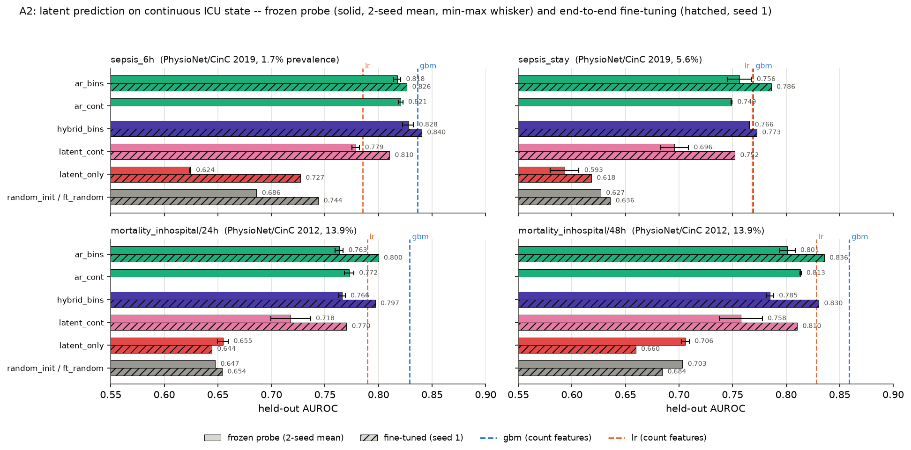

# A2 results — the pre-registered test of latent prediction on continuous ICU state

Outcome of the test specified in [`A2_PLAN.md`](A2_PLAN.md) (written before
training) and in `docs/paper/main.tex`, Section "Where latent prediction stands,
and a pre-registered test on continuous state".

Source directories, each with a `README.md` written before its numbers existed
(the protocol) and a `summary.md`/`summary.json` appended by
`scripts/ablate.py` as each cell finished (the numbers):

| grid | mode | source | commit |
|---|---|---|---|
| [`a2-physionet2019/`](a2-physionet2019/) | frozen linear probe, 2 seeds | PhysioNet/CinC 2019 | `1491da1` |
| [`a2-physionet2012/`](a2-physionet2012/) | frozen linear probe, 2 seeds | PhysioNet/CinC 2012 | `1491da1` |
| [`a2ft-physionet2019/`](a2ft-physionet2019/) | end-to-end fine-tune, seed-1 checkpoints | PhysioNet/CinC 2019 | `e68e4b5` |
| [`a2ft-physionet2012/`](a2ft-physionet2012/) | end-to-end fine-tune, seed-1 checkpoints | PhysioNet/CinC 2012 | `e68e4b5` |

Common protocol: `configs/pretrain_default.yaml` base, each cell trained on its
own grid's source, 100,007,936 nominal token slots per cell on 2019 and
40,009,728 on 2012, evaluation on the FULL held-out split of each source with
200 bootstrap resamples, count-feature `lr`/`gbm` refit on the same split. The
probe grids read `last@final` pooling off a frozen encoder at two training seeds
(`_s1`, `_s2`); the fine-tuning grids take the seed-1 checkpoint of each
objective, train end to end for at most 5 epochs with early stopping on
tuning-split AUROC (patience 2, best epoch's weights restored), and add a
from-scratch control (`ft_random`) with the same schedule.

Objectives, as numbered in `A2_PLAN.md`: `ar_bins` (1) AR over code and decile
value bins; `ar_cont` (2) AR plus a Huber loss on per-code z-scored values;
`hybrid_bins` (3) next-latent plus code loss plus bin loss
(`nextlatent_h1416_recon`); `latent_cont` (4) next-latent plus the Huber value
term, no code loss; `latent_only` (5) next-latent alone. Objective (6), a
hybrid over a pretrained Qwen2.5-0.5B/LoRA encoder, was dropped from all four
grids — see [Cells not run](#cells-not-run).

## Frozen linear probe, 2 seeds

PhysioNet/CinC 2019, full held-out split (31,324 `sepsis_6h` rows, 1.7%
prevalence; `sepsis_stay` at 5.6%). `random_init` is the architecture- and
pooling-matched untrained control (identical for `ar_bins` and `hybrid_bins`;
same untrained causal encoder, same seed).

| objective | sepsis_6h s1 | sepsis_6h s2 | sepsis_6h mean | sepsis_stay s1 | sepsis_stay s2 | sepsis_stay mean |
|---|---|---|---|---|---|---|
| `ar_bins` | 0.8207 | 0.8143 | **0.8175** | 0.7676 | 0.7450 | **0.7563** |
| `ar_cont` | 0.8185 | 0.8227 | **0.8206** | 0.7487 | 0.7495 | **0.7491** |
| `hybrid_bins` | 0.8224 | 0.8327 | **0.8276** | 0.7656 | 0.7658 | **0.7657** |
| `latent_cont` | 0.7751 | 0.7823 | **0.7787** | 0.6828 | 0.7088 | **0.6958** |
| `latent_only` | 0.6240 | 0.6246 | **0.6243** | 0.5796 | 0.6066 | **0.5931** |
| `random_init` | -- | -- | 0.6861 | -- | -- | 0.6269 |
| `gbm` | -- | -- | 0.8363 | -- | -- | 0.7693 |
| `lr` | -- | -- | 0.7852 | -- | -- | 0.7681 |

PhysioNet/CinC 2012, full held-out split (both tasks at 13.9% prevalence).

| objective | mortality/24h s1 | mortality/24h s2 | mortality/24h mean | mortality/48h s1 | mortality/48h s2 | mortality/48h mean |
|---|---|---|---|---|---|---|
| `ar_bins` | 0.7669 | 0.7595 | **0.7632** | 0.8083 | 0.7941 | **0.8012** |
| `ar_cont` | 0.7768 | 0.7682 | **0.7725** | 0.8140 | 0.8129 | **0.8134** |
| `hybrid_bins` | 0.7631 | 0.7689 | **0.7660** | 0.7813 | 0.7883 | **0.7848** |
| `latent_cont` | 0.6994 | 0.7365 | **0.7180** | 0.7375 | 0.7777 | **0.7576** |
| `latent_only` | 0.6597 | 0.6498 | **0.6547** | 0.7022 | 0.7096 | **0.7059** |
| `random_init` | -- | -- | 0.6475 | -- | -- | 0.7032 |
| `gbm` | -- | -- | 0.8292 | -- | -- | 0.8589 |
| `lr` | -- | -- | 0.7894 | -- | -- | 0.8281 |

## End-to-end fine-tuning, seed-1 checkpoints

Point AUROC on the same full held-out splits. `delta vs probe` is the
fine-tuned point minus that objective's 2-seed probe mean above, in AUROC
points.

| objective | sepsis_6h | sepsis_stay | delta vs probe, sepsis_6h | delta vs probe, sepsis_stay |
|---|---|---|---|---|
| `ar_bins` | 0.8264 | 0.7861 | +0.9 | +3.0 |
| `hybrid_bins` | **0.8403** | 0.7726 | +1.3 | +0.7 |
| `latent_cont` | 0.8102 | 0.7521 | +3.2 | +5.6 |
| `latent_only` | 0.7270 | 0.6182 | +10.3 | +2.5 |
| `ft_random` | 0.7438 | 0.6359 | -- | -- |
| `gbm` | 0.8363 | 0.7693 | -- | -- |
| `lr` | 0.7852 | 0.7681 | -- | -- |

| objective | mortality/24h | mortality/48h | delta vs probe, 24h | delta vs probe, 48h |
|---|---|---|---|---|
| `ar_bins` | 0.7999 | 0.8355 | +3.7 | +3.4 |
| `hybrid_bins` | 0.7969 | 0.8304 | +3.1 | +4.6 |
| `latent_cont` | 0.7700 | 0.8103 | +5.2 | +5.3 |
| `latent_only` | 0.6443 | 0.6596 | -1.0 | -4.6 |
| `ft_random` | 0.6540 | 0.6843 | -- | -- |
| `gbm` | 0.8292 | 0.8589 | -- | -- |
| `lr` | 0.7894 | 0.8281 | -- | -- |

## Bootstrap intervals

95% percentile intervals from 200 resamples, from
`eval/<cell>/results.json` in each grid directory.

| task | cell | probe s1 | probe s2 | fine-tune s1 |
|---|---|---|---|---|
| `sepsis_6h` | `ar_bins` | 0.8207 [0.799, 0.837] | 0.8143 [0.794, 0.832] | 0.8264 [0.807, 0.841] |
| | `ar_cont` | 0.8185 [0.799, 0.835] | 0.8227 [0.803, 0.840] | -- |
| | `hybrid_bins` | 0.8224 [0.804, 0.840] | 0.8327 [0.817, 0.850] | 0.8403 [0.822, 0.856] |
| | `latent_cont` | 0.7751 [0.752, 0.795] | 0.7823 [0.762, 0.802] | 0.8102 [0.793, 0.826] |
| | `latent_only` | 0.6240 [0.602, 0.644] | 0.6246 [0.603, 0.645] | 0.7270 [0.702, 0.746] |
| | controls | `random_init` 0.6861 [0.663, 0.707] | `ft_random` 0.7438 [0.721, 0.764] | `gbm` 0.8363 [0.820, 0.855] |
| `sepsis_stay` | `ar_bins` | 0.7676 [0.737, 0.796] | 0.7450 [0.712, 0.777] | 0.7861 [0.755, 0.817] |
| | `ar_cont` | 0.7487 [0.715, 0.783] | 0.7495 [0.721, 0.777] | -- |
| | `hybrid_bins` | 0.7656 [0.736, 0.799] | 0.7658 [0.735, 0.798] | 0.7726 [0.737, 0.805] |
| | `latent_cont` | 0.6828 [0.653, 0.720] | 0.7088 [0.675, 0.747] | 0.7521 [0.719, 0.788] |
| | `latent_only` | 0.5796 [0.542, 0.624] | 0.6066 [0.570, 0.648] | 0.6182 [0.586, 0.655] |
| | controls | `random_init` 0.6269 [0.593, 0.661] | `ft_random` 0.6359 [0.601, 0.668] | `gbm` 0.7693 [0.735, 0.800] |
| `mortality/24h` | `ar_bins` | 0.7669 [0.734, 0.796] | 0.7595 [0.726, 0.792] | 0.7999 [0.768, 0.830] |
| | `ar_cont` | 0.7768 [0.748, 0.813] | 0.7682 [0.738, 0.802] | -- |
| | `hybrid_bins` | 0.7631 [0.732, 0.797] | 0.7689 [0.736, 0.803] | 0.7969 [0.766, 0.829] |
| | `latent_cont` | 0.6994 [0.655, 0.743] | 0.7365 [0.700, 0.780] | 0.7700 [0.732, 0.809] |
| | `latent_only` | 0.6597 [0.607, 0.705] | 0.6498 [0.598, 0.697] | 0.6443 [0.601, 0.694] |
| | controls | `random_init` 0.6475 [0.599, 0.688] | `ft_random` 0.6540 [0.604, 0.699] | `gbm` 0.8292 [0.797, 0.864] |
| `mortality/48h` | `ar_bins` | 0.8083 [0.777, 0.839] | 0.7941 [0.762, 0.824] | 0.8355 [0.807, 0.869] |
| | `ar_cont` | 0.8140 [0.785, 0.848] | 0.8129 [0.782, 0.849] | -- |
| | `hybrid_bins` | 0.7813 [0.745, 0.814] | 0.7883 [0.757, 0.822] | 0.8304 [0.801, 0.860] |
| | `latent_cont` | 0.7375 [0.698, 0.778] | 0.7777 [0.747, 0.819] | 0.8103 [0.778, 0.848] |
| | `latent_only` | 0.7022 [0.664, 0.744] | 0.7096 [0.666, 0.752] | 0.6596 [0.614, 0.708] |
| | controls | `random_init` 0.7032 [0.662, 0.750] | `ft_random` 0.6843 [0.640, 0.728] | `gbm` 0.8589 [0.829, 0.890] |

Regenerate with `python scripts/plot_a2.py`.

## Findings

1. **The code-loss-free latent objectives never beat binned AR.** Every
   `latent_cont` and `latent_only` number in every table above is below every
   `ar_bins` number for the same task: on either dataset, at either probe seed,
   and under fine-tuning. Probe 2-seed means, `latent_cont` against `ar_bins`:
   0.7787/0.8175 (`sepsis_6h`), 0.6958/0.7563 (`sepsis_stay`),
   0.7180/0.7632 (`mortality/24h`), 0.7576/0.8012 (`mortality/48h`).
   Fine-tuned: 0.8102/0.8264, 0.7521/0.7861, 0.7700/0.7999, 0.8103/0.8355.
   `latent_only` is a further 5.2 to 15.4 points below `latent_cont`.
2. **Pure latent pretraining sits at or below its untrained control under the
   probe, and below from-scratch training under fine-tuning.** `latent_only`
   minus `random_init`, 2-seed probe means: $-6.2$ (`sepsis_6h`), $-3.4$
   (`sepsis_stay`), $+0.7$ (`mortality/24h`), $+0.3$ (`mortality/48h`) points;
   the two positive differences are inside each cell's bootstrap interval for
   the control. Fine-tuned `latent_only` minus `ft_random`: $-1.7$, $-1.8$,
   $-1.0$, $-2.5$ points, on all four tasks.
3. **The value-regression auxiliary recovers part of the distance to AR, not
   all of it.** Adding the Huber value term to the pure latent objective moves
   `sepsis_6h` from 0.6243 to 0.7787 under the probe and from 0.7270 to 0.8102
   fine-tuned; `ar_bins` is 0.8175 and 0.8264 on the same task. The same
   direction holds on the other three tasks (finding 1).
4. **The hybrid equals binned AR within the seed spread except on
   `sepsis_6h`.** `hybrid_bins` minus `ar_bins`, probe 2-seed means:
   $+1.0$ (`sepsis_6h`), $+0.9$ (`sepsis_stay`), $+0.3$ (`mortality/24h`),
   $-1.6$ (`mortality/48h`) points, against a per-objective seed spread of
   0.0002 to 0.0226 on the same cells. Fine-tuned, `sepsis_6h` is $+1.4$
   (0.8403 against 0.8264) and it is the only cell in either fine-tuning grid
   above `gbm` on that task (0.8403 against 0.8363); on the other three tasks
   the fine-tuned hybrid is $-1.4$, $-0.3$ and $-0.5$ points from `ar_bins`.
   `ar_cont` leads `ar_bins` on three of four tasks under the probe
   ($+0.3$, $-0.7$, $+0.9$, $+1.2$).
5. **Fine-tuning adds over the probe, and adds more over from-scratch
   training.** Fine-tuned minus 2-seed probe mean, over the three objectives
   that carry a code or value term: $+0.7$ to $+5.6$ points (8 of 8 positive).
   `latent_only` ranges from $-4.6$ to $+10.3$ over the same comparison.
   Fine-tuned minus `ft_random`: $+8.3$ to $+15.1$ points for `ar_bins` and
   `hybrid_bins`, $+6.6$ to $+12.6$ for `latent_cont`, $-2.5$ to $-1.0$ for
   `latent_only`.
6. **`gbm` is ahead of every trained cell on all four tasks under the probe,
   and on the two 2012 tasks once fine-tuning is allowed.** Probe: best cell
   0.8276 against `gbm` 0.8363 (`sepsis_6h`), 0.7657 against 0.7693
   (`sepsis_stay`), 0.7725 against 0.8292 (`mortality/24h`), 0.8134 against
   0.8589 (`mortality/48h`). Fine-tuned: 0.8403 against 0.8363
   (`sepsis_6h`, hybrid ahead), 0.7861 against 0.7693 (`sepsis_stay`,
   `ar_bins` ahead), 0.7999 against 0.8292 and 0.8355 against 0.8589
   (`gbm` ahead on both 2012 tasks).

## Decision-rule verdict

By the rule fixed in [`A2_PLAN.md`](A2_PLAN.md) before training, the latent
objectives without a code loss — (4) `latent_cont` and (5) `latent_only` — do
not beat the binned-AR baseline (1) on any of these four continuous-state
tasks, on either dataset, at either probe seed, or under fine-tuning, so the
JEPA framing — that predicting in representation space is itself the useful
part — is **not supported**; the claim this project's evidence carries is
limited to the hybrid as a regularizer riding on a code-prediction loss.

## Cells not run

**Objective (6), the pretrained language-model encoder, is untested.**
Qwen2.5-0.5B with LoRA over serialized events was in all four pre-registered
grid files and was dropped from all four:

- from the probe grids (commit `039c63c`): a frozen-probe evaluation must
  embed every training anchor to fit the probe — about 315,000 anchors on
  `sepsis_6h` — which the 0.5B encoder does at roughly 200 anchors/minute on
  the RTX 4060, about one day per cell regardless of any held-out cap
  (`a2-physionet2019/README.md`, "LM cells removed from this grid");
- from the fine-tuning grids (commit `b35a09f`): no epoch completed in 14 h on
  the same card, the first forward pass over the training anchors alone
  exceeding the budget (`a2ft-physionet2019/README.md`, "LM cell removed").

So the question objective (6) was written to answer — what a pretrained
language-model encoder contributes on continuous ICU state, which is the
encoder Clin-JEPA uses — is not answered by anything in these grids.

`ar_cont` has no fine-tuning row: it is a control on the value term, and the
fine-tuning grids carry the four objectives the decision rule ranges over.

## Reproducibility note

**The first pass of these probe grids (2026-09-10) was invalid.** The runner
trained every cell on DE-SynPUF and evaluated it on ICU data: the grid's
`source` field reached the evaluator but not the trainer. Commit `89bdf94`
("ablate: train each cell on the grid's own source; the a2 grids had
pretrained on DE-SynPUF") fixed it, and every number above is from a cell
retrained after that commit. The invalid numbers were never committed to this
repository.

Cell-level provenance is in each grid's `summary.json` (`commit` field per
`eval/<cell>/results.json`): the 2019 seed-1 probe cells were scored at
`89bdf94`, the 2019 seed-2 and all 2012 probe cells at `039c63c` (same code
path, LM cells removed from the grid file), the 2019 fine-tuning cells at
`ce0692e` and the 2012 fine-tuning cells at `b35a09f`. The probe grids were
recorded in commit `1491da1` and the fine-tuning grids in `e68e4b5`.
