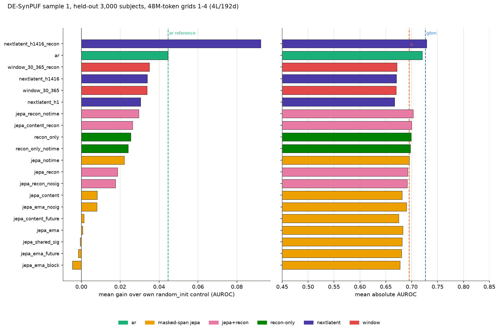
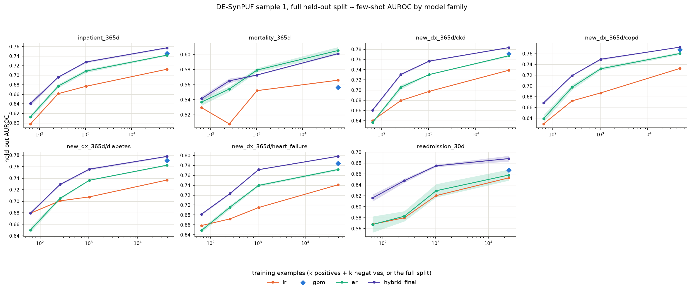

# Pilot results, grids 1-4 — DE-SynPUF sample 1

Consolidates the four ablation grids run so far: 20 trained cells, one held-out
cohort, one token budget, one seed. Source directories:
[`2026-09-03-pilot-desynpuf/`](2026-09-03-pilot-desynpuf/) (grid 1),
[`2026-09-03-pilot2-desynpuf/`](2026-09-03-pilot2-desynpuf/) (grid 2),
[`2026-09-04-pilot3-desynpuf/`](2026-09-04-pilot3-desynpuf/) (grid 3),
[`2026-09-04-pilot4-desynpuf/`](2026-09-04-pilot4-desynpuf/) (grid 4). Each
directory's `README.md` is the protocol written before its numbers existed;
each `summary.md` is the row source this table is built from. Grid 5 (a seed
sweep of `ar` and the hybrid) and a few-shot pass over all eight models are
reported below in their own sections and are not merged into the master
table, which stays grids 1-4 at seed 0.

Common to every row below: `configs/pretrain_pilot.yaml` base (4-layer,
192-wide encoder, 2-layer, 96-wide predictor, SwiGLU, dropout 0.1),
`data/cache/desynpuf-s1` `train` split, 48,005,120 nominal token slots per
trained cell (2,930 steps at batch 64 x `max_len` 256), seed 0, held-out
evaluation on the same seeded 3,000-subject `held_out` cut with 200 bootstrap
resamples across all seven tasks (`inpatient_365d`, `mortality_365d`,
`new_dx_365d/{ckd,copd,diabetes,heart_failure}`, `readmission_30d`).

## Master table

`gain` is mean AUROC across the seven tasks minus the same mean for the row's
own `random_init` control (architecture- and pooling-matched, per the pooling
note below `control` is `--` for `gbm`, `lr`, and the control rows
themselves). `abs` is the row's own mean AUROC across the seven tasks. Sorted
by `abs` descending.

| cell | grid | family | control | inpatient_365d | mortality_365d | ckd | copd | diabetes | heart_failure | readmission_30d | gain | abs |
|---|---|---|---|---|---|---|---|---|---|---|---|---|
| `nextlatent_h1416_recon` | 4 | nextlatent | `random_init@nextlatent_h1` | 0.7417 | 0.6332 | 0.7531 | 0.7487 | 0.7618 | 0.7642 | 0.6985 | +0.0923 | **0.7287** |
| `gbm` | — | count-feature | — | 0.744 | 0.5723 | 0.7654 | 0.7674 | 0.7721 | 0.7893 | 0.6724 | — | 0.7261 |
| `ar` | 1 | ar | `random_init@ar` | 0.7265 | 0.606 | 0.7586 | 0.7552 | 0.759 | 0.7437 | 0.6946 | +0.0445 | 0.7205 |
| `jepa_recon_notime` | 3 | jepa+recon | `random_init@jepa_recon_notime` | 0.7043 | 0.6492 | 0.7116 | 0.7173 | 0.7538 | 0.7144 | 0.6714 | +0.0296 | 0.7031 |
| `jepa_content_recon` | 2 | jepa+recon | `random_init@jepa_notime` | 0.7085 | 0.6265 | 0.7167 | 0.7141 | 0.7432 | 0.7154 | 0.6747 | +0.0263 | 0.6999 |
| `recon_only` | 3 | recon-only | `random_init@jepa_recon_notime` | 0.7077 | 0.6068 | 0.7193 | 0.7155 | 0.7441 | 0.714 | 0.6854 | +0.0254 | 0.6990 |
| `recon_only_notime` | 3 | recon-only | `random_init@jepa_recon_notime` | 0.7009 | 0.6173 | 0.7216 | 0.7117 | 0.7445 | 0.7069 | 0.6804 | +0.0240 | 0.6976 |
| `jepa_notime` | 2 | masked-span jepa | `random_init@jepa_notime` | 0.692 | 0.6332 | 0.7121 | 0.7167 | 0.7477 | 0.7089 | 0.659 | +0.0221 | 0.6957 |
| `lr` | — | count-feature | — | 0.7077 | 0.5537 | 0.7361 | 0.7258 | 0.7397 | 0.7438 | 0.6578 | — | 0.6949 |
| `jepa_recon` | 2 | jepa+recon | `random_init@jepa_notime` | 0.7078 | 0.5954 | 0.7169 | 0.7112 | 0.741 | 0.7122 | 0.6611 | +0.0187 | 0.6922 |
| `jepa_recon_nosig` | 3 | jepa+recon | `random_init@jepa_recon_notime` | 0.6947 | 0.5923 | 0.711 | 0.7138 | 0.7473 | 0.7092 | 0.6703 | +0.0177 | 0.6912 |
| `jepa_ema_nosig` | 1 | masked-span jepa | `random_init@jepa_ema` | 0.6927 | 0.6409 | 0.6968 | 0.6997 | 0.7379 | 0.7031 | 0.6597 | +0.0080 | 0.6901 |
| `jepa_ema` | 1 | masked-span jepa | `random_init@jepa_ema` | 0.6798 | 0.6096 | 0.6944 | 0.7059 | 0.7418 | 0.7027 | 0.646 | +0.0008 | 0.6829 |
| `random_init@jepa_ema` | 1 | control | — | 0.685 | 0.6021 | 0.7005 | 0.6933 | 0.7264 | 0.7001 | 0.6675 | — | 0.6821 |
| `jepa_content` | 2 | masked-span jepa | `random_init@jepa_notime` | 0.6914 | 0.5998 | 0.6984 | 0.701 | 0.7307 | 0.7019 | 0.6488 | +0.0081 | 0.6817 |
| `jepa_shared_sig` | 1 | masked-span jepa | `random_init@jepa_ema` | 0.6784 | 0.6573 | 0.6865 | 0.6948 | 0.7292 | 0.6955 | 0.6293 | -0.0006 | 0.6816 |
| `jepa_ema_future` | 1 | masked-span jepa | `random_init@jepa_ema` | 0.6819 | 0.5837 | 0.6943 | 0.7048 | 0.7382 | 0.7 | 0.6612 | -0.0015 | 0.6806 |
| `jepa_ema_block` | 1 | masked-span jepa | `random_init@jepa_ema` | 0.6763 | 0.5859 | 0.6939 | 0.7035 | 0.7295 | 0.7097 | 0.6442 | -0.0046 | 0.6776 |
| `random_init@ar` | 1 | control | — | 0.6751 | 0.616 | 0.694 | 0.689 | 0.7211 | 0.6904 | 0.6464 | — | 0.6760 |
| `jepa_content_future` | 2 | masked-span jepa | `random_init@jepa_notime` | 0.6784 | 0.5776 | 0.6947 | 0.6975 | 0.7277 | 0.696 | 0.6528 | +0.0014 | 0.6750 |
| `random_init@jepa_notime` (= `@jepa_recon_notime`) | 2/3 | control | — | 0.6775 | 0.5699 | 0.6962 | 0.6961 | 0.7252 | 0.6882 | 0.6619 | — | 0.6736 |
| `window_30_365_recon` | 4 | window | `random_init@nextlatent_h1` | 0.6764 | 0.5944 | 0.6805 | 0.7054 | 0.7274 | 0.6951 | 0.6209 | +0.0350 | 0.6714 |
| `nextlatent_h1416` | 4 | nextlatent | `random_init@nextlatent_h1` | 0.6687 | 0.6063 | 0.6886 | 0.6823 | 0.7198 | 0.6868 | 0.6401 | +0.0340 | 0.6704 |
| `window_30_365` | 4 | window | `random_init@nextlatent_h1` | 0.6725 | 0.586 | 0.6859 | 0.7028 | 0.7279 | 0.6901 | 0.6259 | +0.0337 | 0.6702 |
| `nextlatent_h1` | 4 | nextlatent | `random_init@nextlatent_h1` | 0.6601 | 0.6108 | 0.6829 | 0.6854 | 0.7198 | 0.6867 | 0.6225 | +0.0305 | 0.6669 |
| `random_init@nextlatent_h1` (= `@ar_last`) | 4 | control | — | 0.6469 | 0.5339 | 0.658 | 0.662 | 0.71 | 0.666 | 0.5781 | — | 0.6364 |

`random_init@jepa_notime` and `random_init@jepa_recon_notime` are numerically
identical (same untrained 4x192 bidirectional encoder, same seed 0, `mean@final`
pooling — a probe reads only the embedding and encoder, and neither grid's
recon head or notime flag exists yet at initialisation). Likewise
`random_init@nextlatent_h1` and grid 2's `random_init@ar_last` are identical
(same untrained causal encoder, `last@final`). Both pairs are computed
independently in their own grids rather than reused, and both landing on the
same numbers is a determinism check, not a coincidence to explain away.

Two grid-2 rows are excluded from this table: `ar_last` and `jepa_ema_mean`
train nothing — they re-probe grid 1's `ar` and `jepa_ema` checkpoints under a
different pooling and would double-count those two trained cells as four. See
[`2026-09-03-pilot2-desynpuf/summary.md`](2026-09-03-pilot2-desynpuf/summary.md)
for those two rows directly.

## What each grid asked and answered

**Grid 1** — does JEPA beat AR at matched 48M-token compute, and does either
beat `random_init` with more training than the 900-step sanity runs?

- `ar` mean AUROC 0.7205 vs. its `random_init@ar` control 0.6760: gain +0.0445.
- Five `jepa_ema*` variants (target, SIGReg, masking-mix swept one at a time)
  mean AUROC 0.6776-0.6901 vs. one shared `random_init@jepa_ema` control
  0.6821: gain range -0.0046 to +0.0080.
- Best JEPA variant this grid: `jepa_ema_nosig` (`lambda_sigreg: 0`), 0.6901.

**Grid 2** — do four probe-independent shortcuts (time-conditional prior,
discarded code identity, context-copy through full-window targets, pooling)
explain grid 1's null result, and does closing them move the probe?

- Pre-grid diagnostics: mask-token-time-alone ridge R² 0.58 vs. 0.79 with
  context; code-id probe top-1 0.50 (trained JEPA) vs. 0.60 (untrained) vs.
  0.71 (AR); context-mean-to-target cosine 0.73 without SIGReg.
- Re-measured pooling effect on the `ar` checkpoint: `last` vs. `cls_mean`
  averages +0.17 AUROC over the seven tasks (range -2.07 to +2.77 points),
  not the +2.5-3.3 the original single-task diagnostic reported.
- Five trained cells vs. `random_init@jepa_notime` (0.6736): `jepa_notime`
  +0.0221, `jepa_content` +0.0081, `jepa_content_recon` +0.0263, `jepa_recon`
  +0.0187, `jepa_content_future` +0.0014.

**Grid 3** — with code reconstruction present, does the latent smooth-L1 term
still add anything, and do the notime and recon gains stack or overlap?

- Four cells vs. `random_init@jepa_recon_notime` (0.6736): `jepa_recon_notime`
  (notime + recon) +0.0296, `recon_only` (recon alone, `lambda_pred: 0`)
  +0.0254, `recon_only_notime` +0.0240, `jepa_recon_nosig` +0.0177.
- `recon_only` (no latent term at all) scores 0.0041 AUROC below
  `jepa_recon_notime` (notime + recon + latent term).

**Grid 4** — does dense (per-position) or window-pooled latent prediction
transfer, alone and with code supervision?

- Five cells vs. `random_init@nextlatent_h1` (0.6364): `nextlatent_h1` +0.0305,
  `nextlatent_h1416` +0.0340, `nextlatent_h1416_recon` +0.0923, `window_30_365`
  +0.0337, `window_30_365_recon` +0.0350.
- `nextlatent_h1416_recon` (dense next-latent at horizons [1,4,16] + the AR
  next-code CE through the same tied head) is the top row of all 20 trained
  cells across grids 1-4 by both gain and mean absolute AUROC.

## Figure



Produced by [`scripts/plot_grids.py`](../../scripts/plot_grids.py), which
parses the four `summary.md` files directly — nothing plotted is a number not
already committed in one of those tables. Regenerate with:

```bash
python scripts/plot_grids.py
```

## Grid 5: seeds

Source: [`2026-09-04-pilot5-seeds-desynpuf/`](2026-09-04-pilot5-seeds-desynpuf/).
Grid 1's `ar` and grid 4's `nextlatent_h1416_recon` (the hybrid) reseeded at
`run.seed` 1 and 2 (`ar_s1`/`ar_s2`, `hybrid_s1`/`hybrid_s2`), same base
config, same 48M-token budget, same `desynpuf-s1` cache, same held-out subset
and bootstrap protocol as grids 1-4. `random_init@ar_s1` and
`random_init@hybrid_s1` are each computed once and shared across their
architecture's three seeds (see the grid's own README for why re-deriving a
control per seed would repeat the identical `torch.manual_seed(0)` draw).

3-seed mean and std of held-out AUROC, `{ar, ar_s1, ar_s2}` vs.
`{nextlatent_h1416_recon, hybrid_s1, hybrid_s2}`, per task:

| task | ar mean ± std | ar range | hybrid mean ± std | hybrid range |
|---|---|---|---|---|
| `inpatient_365d` | 0.7417 ± 0.0027 | [0.7392, 0.7455] | 0.7445 ± 0.0025 | [0.7417, 0.7479] |
| `mortality_365d` | 0.6034 ± 0.0061 | [0.5951, 0.6094] | 0.6219 ± 0.0109 | [0.6072, 0.6332] |
| `new_dx_365d/ckd` | 0.7480 ± 0.0044 | [0.7419, 0.7514] | 0.7525 ± 0.0018 | [0.7501, 0.7543] |
| `new_dx_365d/copd` | 0.7604 ± 0.0009 | [0.7592, 0.7613] | 0.7515 ± 0.0023 | [0.7487, 0.7544] |
| `new_dx_365d/diabetes` | 0.7618 ± 0.0032 | [0.7574, 0.7652] | 0.7643 ± 0.0033 | [0.7618, 0.7689] |
| `new_dx_365d/heart_failure` | 0.7660 ± 0.0069 | [0.7562, 0.7714] | 0.7636 ± 0.0041 | [0.7584, 0.7683] |
| `readmission_30d` | 0.6824 ± 0.0064 | [0.6738, 0.6890] | 0.6969 ± 0.0031 | [0.6926, 0.6996] |

Mean AUROC across the 7 tasks: `ar` 0.7234, hybrid 0.7279 (3-seed means of
the per-task 3-seed means above). Per task, the `ar`-vs-hybrid gap is smaller
than at least one of the two families' own seed ranges on `inpatient_365d`,
`new_dx_365d/ckd`, `new_dx_365d/diabetes`, and `new_dx_365d/heart_failure`;
it exceeds both ranges on `mortality_365d`, `new_dx_365d/copd`, and
`readmission_30d`.

## Few-shot

Source: [`2026-09-04-fewshot-desynpuf/`](2026-09-04-fewshot-desynpuf/), full
table and protocol in [`results.md`](2026-09-04-fewshot-desynpuf/results.md).
Same held-out subset, anchors, and bootstrap settings as above, `lr`/`gbm`
plus the same six `ar`/hybrid checkpoints from grid 5, scored at few-shot
training sizes `k=32` and `k=128` (`k` positives + `k` negatives) in addition
to the full split. `ar`/hybrid values are the mean over the 3 training seeds
of each checkpoint's own mean over 5 few-shot-sample seeds; `lr`'s is the
std over its 5 few-shot-sample seeds directly (one model, no training-seed
axis). `gbm` has no few-shot fits in the current eval path (`ehrjepa.eval.
run.evaluate_task` only fits few-shot subsamples for `lr`/probe models) and
is omitted from this table; its full-split numbers are in the master table
above.

| task | lr k=32 | lr k=128 | ar k=32 | ar k=128 | hybrid k=32 | hybrid k=128 |
|---|---|---|---|---|---|---|
| `inpatient_365d` | 0.5912 ± 0.0000 | 0.6575 ± 0.0000 | 0.6707 ± 0.0015 | 0.7058 ± 0.0045 | 0.6591 ± 0.0012 | 0.6976 ± 0.0023 |
| `mortality_365d` | 0.5265 ± 0.0000 | 0.5332 ± 0.0000 | 0.5510 ± 0.0019 | 0.5668 ± 0.0071 | 0.5636 ± 0.0028 | 0.5942 ± 0.0037 |
| `new_dx_365d/ckd` | 0.6320 ± 0.0000 | 0.6701 ± 0.0000 | 0.6739 ± 0.0017 | 0.7134 ± 0.0048 | 0.6758 ± 0.0020 | 0.7035 ± 0.0036 |
| `new_dx_365d/copd` | 0.6281 ± 0.0000 | 0.6666 ± 0.0000 | 0.6840 ± 0.0042 | 0.7176 ± 0.0011 | 0.6696 ± 0.0031 | 0.7036 ± 0.0025 |
| `new_dx_365d/diabetes` | 0.6838 ± 0.0000 | 0.7031 ± 0.0000 | 0.6940 ± 0.0051 | 0.7356 ± 0.0018 | 0.6967 ± 0.0021 | 0.7324 ± 0.0040 |
| `new_dx_365d/heart_failure` | 0.6483 ± 0.0000 | 0.6663 ± 0.0000 | 0.6934 ± 0.0056 | 0.7227 ± 0.0050 | 0.6876 ± 0.0017 | 0.7042 ± 0.0026 |
| `readmission_30d` | 0.5680 ± 0.0000 | 0.5880 ± 0.0000 | 0.5766 ± 0.0078 | 0.5994 ± 0.0062 | 0.6100 ± 0.0037 | 0.6487 ± 0.0009 |

## Figure (few-shot)



Produced by [`scripts/plot_fewshot.py`](../../scripts/plot_fewshot.py); see
[`2026-09-04-fewshot-desynpuf/README.md`](2026-09-04-fewshot-desynpuf/README.md)
for the full protocol.

## Caveats

- **Single seed.** Resolved for `ar` and the hybrid only: grid 5 (above)
  gives both 3 seeds. Every other cell in the master table — every
  masked-span JEPA, JEPA+recon, recon-only, and window variant — is still
  seed 0.
- **DE-SynPUF has no labs.** It is a CMS claims-derived public-use file with no
  lab results, vitals, or notes — event types available to the model are
  narrower than a typical clinical dataset, and low AUROCs are partly a
  property of the source.
- **48M tokens.** ≈2.0 epochs of the 11.3M-event `train` split at this budget;
  not a claim about what any objective can do with more compute.
- **3,000-subject held-out subset**, not the full `held_out` split.
- **The embedding table is 74% of trainable parameters** (5,892,288 of
  7,959,680 for a JEPA cell — a 30,000 x 192 code table plus value-bin terms):
  at this model size, encoder capacity is a minority of what is being trained.
- **Controls differ by pooling across grids.** Grid 1 probes every cell at
  `cls_mean@final`. Grids 2-4 resolve pooling per architecture (`auto`):
  `mean@final` for bidirectional encoders, `last@final` for causal ones. A
  cell's `gain` in the table above is always against a control computed at
  the same pooling as the cell itself, but grid-1 numbers are not directly
  comparable to grid 2-4 numbers for the same reason — they are different
  probes reading the same encoder.
