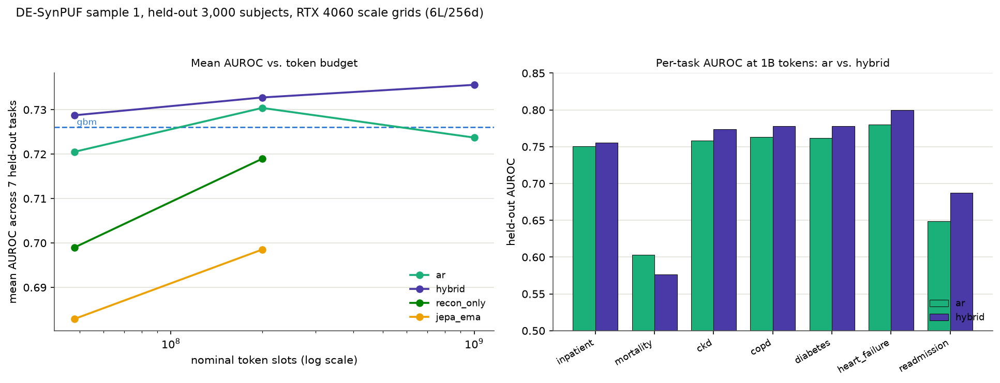

# Scale results — DE-SynPUF sample 1, RTX 4060

Consolidates the two token-scaling grids run on CUDA hardware (an RTX 4060,
8 GB VRAM) against the 48M-token pilot grids (`docs/experiments/PILOT_RESULTS.md`,
run on Apple M4/MPS). Source directories:
[`scale-desynpuf/`](scale-desynpuf/) (200M tokens, 6L/256d encoder) and
[`scale1b-desynpuf/`](scale1b-desynpuf/) (1B tokens, same encoder). Each
directory's `README.md` is the protocol written before its numbers existed;
each `summary.md` is the row source the tables below are built from.

Common to every 200M/1B row: `configs/pretrain_scale.yaml` base (6-layer,
256-wide encoder, 4-layer, 128-wide predictor, SwiGLU, dropout 0.1),
`data/cache/desynpuf-s1` `train` split, seed 0, held-out evaluation on the
same seeded 3,000-subject `held_out` cut with 200 bootstrap resamples across
all seven tasks (`inpatient_365d`, `mortality_365d`,
`new_dx_365d/{ckd,copd,diabetes,heart_failure}`, `readmission_30d`) as the
pilot grids. The pilot rows below (48M tokens, 4-layer/192-wide encoder,
seed 0) are `ar` and `hybrid` (`nextlatent_h1416_recon`) from
`docs/experiments/PILOT_RESULTS.md`'s master table.

The 1B `ar` row was re-evaluated after commit `8721a62` fixed an
embedding-cache key collision in the eval harness (a second grid's cell
sharing the display name `ar` had been silently reusing another grid's
cached embeddings); see [`scale1b-desynpuf/README.md`](scale1b-desynpuf/README.md)
for the mechanism.

## All trained cells

`control` is the row's own `random_init` (untrained, architecture- and
pooling-matched) reference. `gain` is mean AUROC across the seven tasks minus
the same mean for `control`. `mean` is the row's own mean AUROC across the
seven tasks. `gbm` and `lr` are count-feature baselines, reused from the same
`predictions.parquet` at every token budget (they do not depend on the
encoder). Sorted by `scale`, then `mean` descending within each scale.

| cell | scale | family | control | inpatient_365d | mortality_365d | ckd | copd | diabetes | heart_failure | readmission_30d | mean | gain |
|---|---|---|---|---|---|---|---|---|---|---|---|---|
| `hybrid` | 48M | nextlatent | `random_init@nextlatent_h1` | 0.7417 | 0.6332 | 0.7531 | 0.7487 | 0.7618 | 0.7642 | 0.6985 | 0.7287 | +0.0923 |
| `ar` | 48M | ar | `random_init@ar` | 0.7265 | 0.6060 | 0.7586 | 0.7552 | 0.7590 | 0.7437 | 0.6946 | 0.7205 | +0.0445 |
| `gbm` | — | count-feature | — | 0.7440 | 0.5723 | 0.7654 | 0.7674 | 0.7721 | 0.7893 | 0.6724 | 0.7261 | — |
| `lr` | — | count-feature | — | 0.7077 | 0.5537 | 0.7361 | 0.7258 | 0.7397 | 0.7438 | 0.6578 | 0.6949 | — |
| `hybrid` | 200M | nextlatent | `random_init@ar` | 0.7511 | 0.5919 | 0.7761 | 0.7676 | 0.7729 | 0.7767 | 0.6930 | 0.7328 | +0.0781 |
| `ar` | 200M | ar | `random_init@ar` | 0.7515 | 0.5946 | 0.7624 | 0.7747 | 0.7714 | 0.7908 | 0.6674 | 0.7304 | +0.0757 |
| `recon_only` | 200M | recon-only | `random_init@jepa_ema` | 0.7326 | 0.6508 | 0.7336 | 0.7242 | 0.7568 | 0.7453 | 0.6894 | 0.7190 | +0.0448 |
| `jepa_ema` | 200M | masked-span jepa | `random_init@jepa_ema` | 0.6948 | 0.6413 | 0.7108 | 0.7189 | 0.7499 | 0.7159 | 0.6580 | 0.6985 | +0.0243 |
| `hybrid` | 1B | nextlatent | `random_init@hybrid` | 0.7553 | 0.5767 | 0.7741 | 0.7781 | 0.7779 | 0.7997 | 0.6874 | **0.7356** | +0.0809 |
| `ar` | 1B | ar | `random_init@ar` | 0.7506 | 0.6028 | 0.7586 | 0.7629 | 0.7618 | 0.7804 | 0.6490 | 0.7237 | +0.0691 |

`random_init@ar` is 0.6547 mean AUROC at both 200M and 1B (same untrained 6L/256d
causal encoder, same seed); `random_init@hybrid` at 1B is numerically identical
to `random_init@ar` for the same reason grids 1-4 saw this (a probe reads only
the untrained embedding and encoder, and neither the AR head nor the
`nextlatent` heads exist at initialisation). `random_init@jepa_ema` at 200M is
0.6742.

## Scaling: ar vs. hybrid, 48M → 200M → 1B

| tokens | ar mean AUROC | ar readmission_30d | hybrid mean AUROC | hybrid readmission_30d |
|---|---|---|---|---|
| 48M | 0.7205 | 0.6946 | 0.7287 | 0.6985 |
| 200M | 0.7304 | 0.6674 | 0.7328 | 0.6930 |
| 1B | 0.7237 | 0.6490 | **0.7356** | **0.6874** |

## Figure



Produced by [`scripts/plot_scale.py`](../../scripts/plot_scale.py), which
parses the five committed `summary.md` files directly (the three pilot grids
that contributed a 48M-token point, plus both scale grids) — nothing plotted
is a number not already committed in one of those tables. Regenerate with:

```bash
python scripts/plot_scale.py
```

## Findings

- `ar` mean AUROC: 0.7205 (48M) → 0.7304 (200M) → 0.7237 (1B). It does not
  improve from 200M to 1B (-0.0067) and drops on four tasks over that step:
  `new_dx_365d/copd` (0.7747 → 0.7629, -0.0118), `new_dx_365d/diabetes`
  (0.7714 → 0.7618, -0.0096), `new_dx_365d/heart_failure`
  (0.7908 → 0.7804, -0.0104), `readmission_30d` (0.6674 → 0.6490, -0.0184).
- `hybrid` mean AUROC improves at every step: 0.7287 (48M) → 0.7328 (200M) →
  0.7356 (1B), +0.0041 then +0.0028.
- At 1B, `hybrid` leads `ar` on six of the seven tasks — every task except
  `mortality_365d` — by 0.47 to 3.84 AUROC points: `inpatient_365d` +0.47,
  `new_dx_365d/ckd` +1.55, `new_dx_365d/copd` +1.52, `new_dx_365d/diabetes`
  +1.61, `new_dx_365d/heart_failure` +1.93, `readmission_30d` +3.84.
  `ar` leads on `mortality_365d` (0.6028 vs. 0.5767, +2.61 points).
- `hybrid` at 1B (0.7356 mean AUROC) is the highest mean AUROC of any cell in
  this table, above `gbm` (0.7261) and `lr` (0.6949).
- `recon_only` and `jepa_ema` were run through 200M only (0.7190 and 0.6985
  mean AUROC, gains +0.0448 and +0.0243) and have no 1B row.
- Every 200M and 1B row above is a single seed (seed 0). A seed-replication
  grid at 1B (`scale1b-seeds-desynpuf`: seeds 1 and 2 for `ar` and `hybrid`)
  is running now; its rows are not in this table.

## Caveats

- **DE-SynPUF has no labs.** It is a CMS claims-derived public-use file with
  no lab results, vitals, or notes — the same caveat as the pilot grids.
- **3,000-subject held-out subset**, not the full `held_out` split — same
  subset, anchors, and seed as the pilot grids.
- **The embedding table is a smaller majority of trainable parameters at this
  scale than at the pilot's.** For the 6L/256d `hybrid` cell: 7,905,536 of
  13,208,336 trainable parameters (60%, a 30,000 × 256 code table plus
  value/age/delta encoders, EMA target copy excluded). For `ar`: 7,905,536 of
  12,665,104 (62%). Both are down from 74% at the pilot's 4L/192d scale —
  encoder and predictor capacity grows faster than the embedding table as
  depth and width scale, at a fixed 30,000-code vocabulary.
- **Single seed at 1B.** Both `ar` and `hybrid` at 1B are seed 0 only; the
  200M-to-1B comparisons above rest on one training run per cell per budget.
  `scale1b-seeds-desynpuf` (seeds 1, 2) is running now and is not yet
  reflected here.
